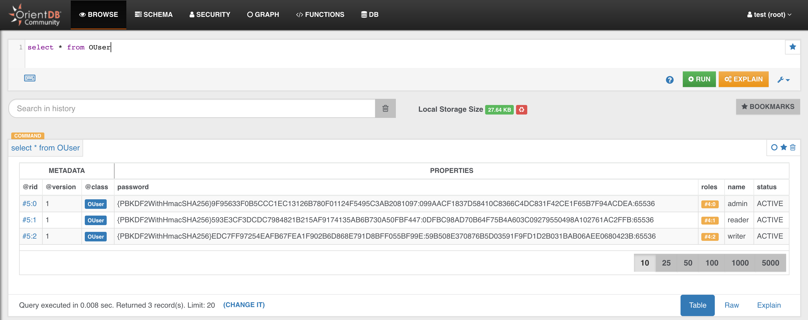

# OrientDB for Java Developers in Five Minutes

In the [Previous Step](java.md) you installed and started OrientDB on your machine, now it's time to create a database

## Step 2/5 - Create a DB

Open your favourite browser (modern browser, no IE please!) and enter the following URL:

http://localhost:2480/studio/index.html

You will see this page:

- Click on "NEW DB"


- enter "test" as database name 
- enter the root password


- Then click on "CREATE DATABASE"

> IMPORTANT: In v 3.2 new databases are created without default db users (admin/reader/writer) to avoid possible vulnerabilities due to default passwords. In this dialog you can select "Create Admin user" and enter a custom admin password for this user.

**Good job! You just created your first database!** 

Now, to make sure that everything is OK, try to enter the following query

```sql
SELECT * FROM OUser
```

and click the green "RUN" button. You should see the three default users that OrientDB creates for you: admin, reader and writer




Now you are ready for the [Next Step - Create your Java Application >>>](java-2.md)
