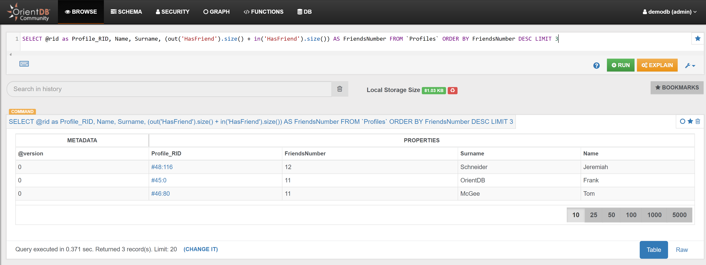

# Profiles

## Example 1

Find the 'year of birth' of the Profiles, and how many Profiles were born in the same year:

```sql
SELECT 
  count(*) as NumberOfProfiles, 
  Birthday.format('yyyy') AS YearOfBirth 
FROM Profiles 
GROUP BY YearOfBirth 
ORDER BY NumberOfProfiles DESC
```

In the _Browse Tab_ of [Studio](../../../studio/README.md), using the query above, this is the obtained list of records (only few records are shown in the image below):


_Note_: in v. 2.x the corresponding query is:

```sql
SELECT 
  count(*) as NumberOfProfiles, 
  YearOfBirth 
FROM (
  SELECT  
    Birthday.format('yyyy') AS YearOfBirth
  FROM Profiles)
GROUP BY YearOfBirth
ORDER BY NumberOfProfiles DESC
```


## Example 2

Find the top 3 Profiles that have the highest number of Friends:

```sql
SELECT 
  @rid as Profile_RID, 
  Name, 
  Surname, 
  both('HasFriend').size() AS FriendsNumber 
FROM `Profiles` 
ORDER BY FriendsNumber DESC 
LIMIT 3
```

In the _Browse Tab_ of [Studio](../../../studio/README.md), using the query above, this is the obtained list of records:


