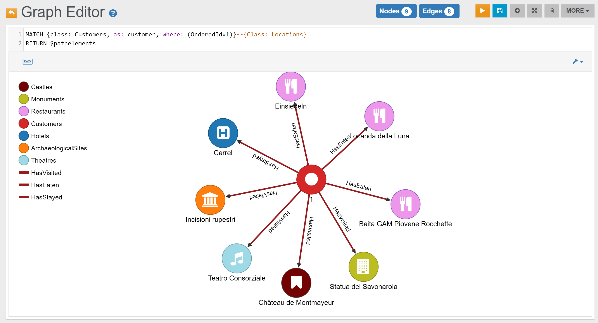

Find all Locations connected to Customer with OrderedId 1:

```sql
MATCH {class: Customers, as: customer, where: (OrderedId=1)}--{Class: Locations} 
RETURN $pathelements
```

In the _Graph Editor_ included in [Studio](../../../studio/README.md), using _'RETURN $pathelements'_ as `RETURN` clause, this is the obtained graph:


