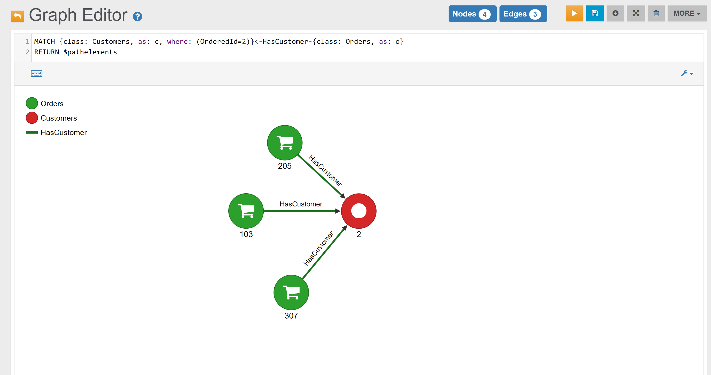

Find all Orders placed by Customer with Id 2:

```sql
MATCH {class: Customers, as: c, where: (OrderedId=1)}<-HasCustomer-{class: Orders, as: o} 
RETURN $pathelements
```

In the _Graph Editor_ included in [Studio](../../../studio/README.md), using _'RETURN $pathelements'_ as `RETURN` clause, this is the obtained graph:


