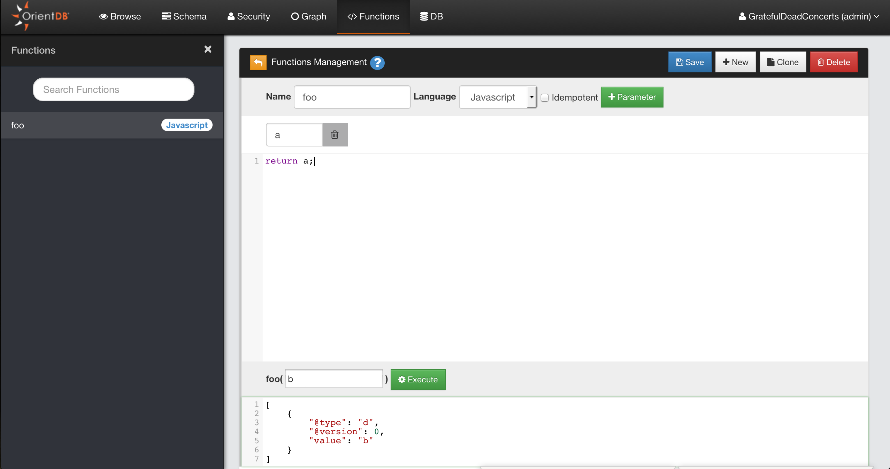

---
search:
   keywords: ['Studio', 'functions']
---

# Functions

OrientDB allows to extend the SQL language by providing [Functions](../Functions.md). Functions can be used also to create data-driven micro services. For more information look at [Functions](../Functions.md).

