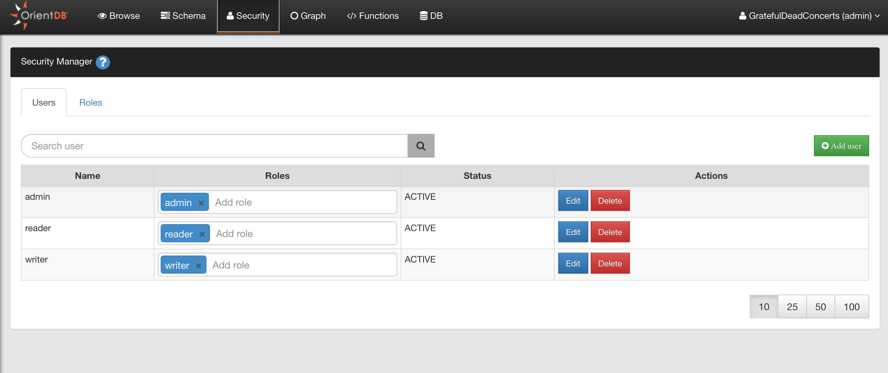
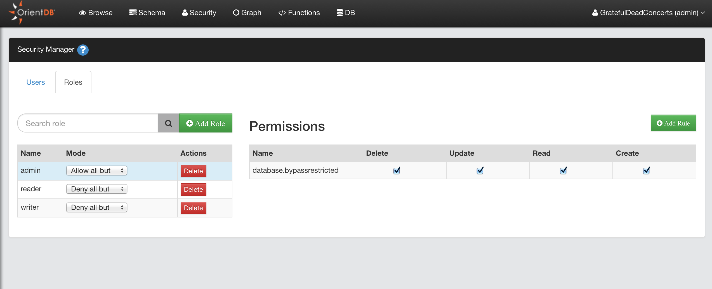

---
search:
   keywords: ['Studio', 'security']
---

# _Security Manager_ Panel

The _Security Manager_ panel allows you to manage _Database_ Users and Roles in a graphical way.
For detailed information about Security in OrientDB, visit [here](../security/Security.md)

## Tab Users

Here you can manage the database users:

* Search Users
* Add Users
* Delete Users
* Edit User: roles can be edited in-line, for name, status and password click the **Edit** button

## Tab Roles

Here you can manage the database roles:

* Search Role
* Add Role
* Delete Role
* Edit Role

